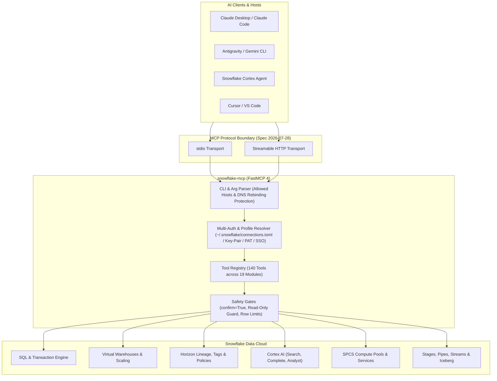

<!-- mcp-name: io.github.christianclaudio/mcp-server-snowflake -->
# ❄️ mcp-server-snowflake

[](https://github.com/christianclaudio/mcp-server-snowflake/actions/workflows/ci.yml)
[](https://github.com/christianclaudio/mcp-server-snowflake/pkgs/container/mcp-server-snowflake)
[](https://github.com/christianclaudio/mcp-server-snowflake/releases)
[](https://opensource.org/licenses/Apache-2.0)
[](https://github.com/christianclaudio/mcp-server-snowflake)
[](https://coderabbit.ai)

> **Supercharge AI Agents with Native Snowflake Data Cloud & Cortex AI Superpowers!** ⚡  
> An enterprise-grade Model Context Protocol (MCP) server providing **140 tools** across 19 domain modules, dynamic profile switching, zero-config connection resolution, safe SQL execution, virtual warehouse management, object inspection, Horizon data lineage, and Cortex AI integrations straight to your favorite AI assistant.

---

## 🏛️ System Architecture



---

## 🛡️ Enterprise Disclaimers & Safety

> [!IMPORTANT]
> **Community Project Disclaimer**  
> `mcp-server-snowflake` is an independent open-source project licensed under **Apache 2.0**. It is **not** affiliated with, sponsored by, endorsed by, or supported by Snowflake Inc. *"Snowflake"* and *"Cortex"* are trademarks of Snowflake Inc.

> [!WARNING]
> **Safety Guardrails**  
> - **Read-Only Safety Mode:** Set `SNOWFLAKE_MCP_READONLY=1`, pass `--readonly`, or pass `--profile readonly` to block mutating tools. The profile sets the same read-only flag the gate reads. On each new session, read-only mode runs `USE SECONDARY ROLES NONE` before any tool SQL and closes the connection if that pin fails. Write mode does not run that statement. Objects readable only through a secondary role's grants are not visible under `--readonly` until the read-only primary role is granted `SELECT` on them directly. Set `DEFAULT_SECONDARY_ROLES = ()` on the read-only user, or use a dedicated user that holds only that role. Prefer a programmatic access token with `ROLE_RESTRICTION` set to the read-only role so Snowflake evaluates privileges under that role ([programmatic access tokens](https://docs.snowflake.com/en/user-guide/programmatic-access-tokens)). `ROLE_RESTRICTION` does not replace the session pin. See FAQ / Troubleshooting.  
> - **Caller SQL:** `queries_query`, `queries_get_query_plan`, and the `query` arguments of `recipes_warehouse_scale_and_execute` and `recipes_export_query_to_stage` refuse anything that is not one read-only statement, whether or not read-only mode is on. Allowed forms are one `SELECT` (no `INTO`), `SHOW`, `DESCRIBE`/`DESC`, or `EXPLAIN SELECT`. `SYSTEM$` calls are refused except `SYSTEM$TYPEOF` and `SYSTEM$CLUSTERING_INFORMATION`. `IDENTIFIER(...)` in call position and `TABLE(IDENTIFIER(...))` are refused. User-defined functions inside `SELECT` are not inspected.  
> - **Destructive Safety Gates:** Dropping databases, schemas, or tables requires explicit `confirm=True`.  
> - **Query Limits:** Default execution limits prevent context window overflow (`SNOWFLAKE_MAX_ROWS=1000`, `SNOWFLAKE_QUERY_TIMEOUT=120`).

---

## ❓ FAQ / Troubleshooting

### Read-only secondary-roles pin

In read-only mode (`--readonly`, `--profile readonly`, or `SNOWFLAKE_MCP_READONLY=1`), each new session runs `USE SECONDARY ROLES NONE` before any tool SQL. If that pin fails, the server fails closed: the connection is closed and not served. Write mode does not run the statement.

Objects readable only through a secondary role's grants need `SELECT` granted on the primary role (the read-only role) directly. Set `DEFAULT_SECONDARY_ROLES = ()` on the read-only user, or use a dedicated user that holds only that role.

### Empty success vs a rejected missing object

Some describe and lineage tools return an empty success for a missing name. That result is the tool behavior. The live harness records it as `expect: success`. An empty success here is not a harness bug:

- `warehouses_describe_warehouse`
- `governance_describe_role`
- `tags_describe_tag`
- `horizon_get_object_lineage`
- `horizon_get_column_lineage`

`warehouses_describe_warehouse`, `governance_describe_role`, and `tags_describe_tag` run `SHOW ... LIKE` and return `status: success` with empty details when nothing matches. `horizon_get_object_lineage` and `horizon_get_column_lineage` return `status: success` when the account-usage query succeeds, including when the named object is absent.

Most other missing-object describe tools still reject: the handler returns `status: error`, and the live harness records `expect: rejected`. The fixture table and marker lists are in [TESTING.md](TESTING.md) under **Live e2e expect policy**.

### Programmatic access tokens and `ROLE_RESTRICTION`

Prefer `ROLE_RESTRICTION` on a programmatic access token set to the read-only role, so Snowflake evaluates privileges under that role ([programmatic access tokens](https://docs.snowflake.com/en/user-guide/programmatic-access-tokens)).

`ROLE_RESTRICTION` does not replace the session pin. Read-only mode still runs `USE SECONDARY ROLES NONE` on every new session. Live checks showed an unrestricted programmatic access token can still surface secondary roles until that statement runs.

---

## 🔌 Connection & Multi-Auth Resolution

`mcp-server-snowflake` automatically resolves credentials across all enterprise Snowflake configurations:

1. **Snowflake CLI Inheritance (`~/.snowflake/connections.toml`)**:
   Zero-configuration connection. If you have configured connections via `snow`, the server automatically connects to your default or specified profile (`-c <conn_name>`).
2. **Dynamic Profile Switching**:
   Switch active connection profiles on the fly via `governance_use_connection(connection_name)` and inspect available profiles with `governance_list_connections`.
3. **Programmatic Access Tokens (PAT) / OAuth**:
   Set `token` in connections profile or `SNOWFLAKE_TOKEN`.
4. **RSA Key-Pair JWT Authentication**:
   Set `SNOWFLAKE_PRIVATE_KEY_PATH` (and optional `SNOWFLAKE_PRIVATE_KEY_PASSPHRASE`).
5. **SSO / Browser Authentication**:
   Set `SNOWFLAKE_AUTHENTICATOR=externalbrowser`.
6. **Environment Variables**:
   Standard `SNOWFLAKE_ACCOUNT`, `SNOWFLAKE_USER`, `SNOWFLAKE_PASSWORD`, `SNOWFLAKE_WAREHOUSE`, `SNOWFLAKE_DATABASE`, `SNOWFLAKE_SCHEMA`, `SNOWFLAKE_ROLE`.

---

## 📦 Installation & Quickstart

```bash
# PyPI publication is pending dispute #11989.
# Install from GitHub
uvx --from git+https://github.com/christianclaudio/mcp-server-snowflake snowflake-mcp

# Or run the GHCR image
docker run -i --rm ghcr.io/christianclaudio/mcp-server-snowflake

# Interactive setup wizard
snowflake-mcp --init

# Run with a specific Snowflake CLI connection profile
snowflake-mcp -c my_connection

# Run in read-only mode (every tool stays registered; handlers reject mutations)
snowflake-mcp -c my_connection --readonly

# List one domain, or only read-only tools
snowflake-mcp --profile cortex
snowflake-mcp --profile readonly
# `--profile readonly` hides mutating tools, sets the read-only flag, and pins USE SECONDARY ROLES NONE on each session.
# Set DEFAULT_SECONDARY_ROLES = () on that user, or use a dedicated user that holds only the read-only role.

# Opt in to regex tool search instead of the flat 140-tool tools/list
snowflake-mcp --enable-tool-search

# Build a local image (the published image is ghcr.io/christianclaudio/mcp-server-snowflake)
docker build -t mcp-server-snowflake .
docker run -i --rm mcp-server-snowflake
```

---

## 🛠️ Complete Tool Suite (140 Enterprise Tools)

| Domain Suite | Count | Key Tools |
|---|---|---|
| **1. SQL Queries & Transactions** | 9 | `queries_query`, `queries_execute_dml`, `queries_cancel_query`, `queries_get_query_history`, `queries_get_query_plan`, `queries_get_query_operator_stats`, `queries_begin_transaction`, `queries_commit_transaction`, `queries_rollback_transaction` |
| **2. Databases & Clones** | 7 | `databases_list_databases`, `databases_describe_database`, `databases_create_database`, `databases_drop_database`, `databases_clone_database`, `databases_undrop_database`, `databases_get_database_ddl` |
| **3. Schemas & Clones** | 6 | `schemas_list_schemas`, `schemas_describe_schema`, `schemas_create_schema`, `schemas_drop_schema`, `schemas_clone_schema`, `schemas_undrop_schema` |
| **4. Tables, Views & Partitions** | 10 | `tables_list_tables`, `tables_list_views`, `tables_describe_table`, `tables_get_table_ddl`, `tables_sample_table`, `tables_create_table`, `tables_drop_table`, `tables_undrop_table`, `tables_truncate_table`, `tables_clone_table` |
| **5. Virtual Warehouses & Scaling** | 8 | `warehouses_list_warehouses`, `warehouses_describe_warehouse`, `warehouses_create_warehouse`, `warehouses_drop_warehouse`, `warehouses_resume_warehouse`, `warehouses_suspend_warehouse`, `warehouses_resize_warehouse`, `warehouses_get_warehouse_load_history` |
| **6. Stages & File Operations** | 6 | `stages_list_stages`, `stages_describe_stage`, `stages_create_stage`, `stages_drop_stage`, `stages_list_stage_files`, `stages_remove_stage_file` |
| **7. Tasks & DAG Pipelines** | 7 | `tasks_list_tasks`, `tasks_describe_task`, `tasks_create_task`, `tasks_drop_task`, `tasks_resume_task`, `tasks_suspend_task`, `tasks_execute_task` |
| **8. Streams & Change Data Capture** | 5 | `streams_list_streams`, `streams_describe_stream`, `streams_create_stream`, `streams_drop_stream`, `streams_read_stream_changes` |
| **9. Dynamic & Iceberg Tables** | 9 | `dynamic_tables_list_dynamic_tables`, `dynamic_tables_describe_dynamic_table`, `dynamic_tables_refresh_dynamic_table`, `dynamic_tables_resume_dynamic_table`, `dynamic_tables_suspend_dynamic_table`, `dynamic_tables_list_iceberg_tables`, `dynamic_tables_describe_iceberg_table`, `dynamic_tables_list_external_volumes`, `dynamic_tables_list_catalog_integrations` |
| **10. Snowpipe & Ingestion** | 5 | `pipes_list_pipes`, `pipes_describe_pipe`, `pipes_create_pipe`, `pipes_drop_pipe`, `pipes_get_pipe_status` |
| **11. Alerts & Notifications** | 6 | `alerts_list_alerts`, `alerts_describe_alert`, `alerts_create_alert`, `alerts_drop_alert`, `alerts_resume_alert`, `alerts_suspend_alert` |
| **12. Governance, RBAC & Users** | 12 | `governance_get_current_context`, `governance_list_connections`, `governance_use_connection`, `governance_list_roles`, `governance_describe_role`, `governance_create_role`, `governance_drop_role`, `governance_list_users`, `governance_describe_user`, `governance_create_user`, `governance_list_grants_to_role`, `governance_list_grants_to_user` |
| **13. Network & Password Policies** | 6 | `network_list_network_policies`, `network_describe_network_policy`, `network_list_network_rules`, `network_describe_network_rule`, `network_list_password_policies`, `network_describe_password_policy` |
| **14. SPCS Compute Pools & Streamlit** | 8 | `compute_services_list_streamlits`, `compute_services_describe_streamlit`, `compute_services_list_compute_pools`, `compute_services_describe_compute_pool`, `compute_services_resume_compute_pool`, `compute_services_suspend_compute_pool`, `compute_services_list_services`, `compute_services_list_image_repositories` |
| **15. Object Tags & Classifications** | 4 | `tags_list_tags`, `tags_describe_tag`, `tags_get_object_tag_references`, `tags_set_object_tag` |
| **16. Horizon Lineage & Governance** | 6 | `horizon_get_object_lineage`, `horizon_get_column_lineage`, `horizon_list_masking_policies`, `horizon_describe_masking_policy`, `horizon_list_row_access_policies`, `horizon_describe_row_access_policy` |
| **17. Programmability, UDFs & Secrets** | 10 | `programmability_list_procedures`, `programmability_describe_procedure`, `programmability_list_functions`, `programmability_describe_function`, `programmability_list_secrets`, `programmability_describe_secret`, `programmability_list_sequences`, `programmability_list_integrations`, `programmability_list_event_tables`, `programmability_list_notification_integrations` |
| **18. Cortex AI & NLP Extensions** | 8 | `cortex_complete`, `cortex_summarize`, `cortex_sentiment`, `cortex_extract_answer`, `cortex_translate`, `cortex_search`, `cortex_embed_text_768`, `cortex_analyst_query` |
| **19. Composite Agent Workflows** | 8 | `recipes_health_check`, `recipes_inspect_table_with_sample`, `recipes_profile_table`, `recipes_warehouse_scale_and_execute`, `recipes_clone_table_recipe`, `recipes_export_query_to_stage`, `recipes_account_usage_summary`, `recipes_discover_schema_lineage` |

---

## 🔌 Integration Guides for AI Assistants & IDEs

`mcp-server-snowflake` works seamlessly with all major AI assistants, IDEs, and CLI tools via standard `stdio` or `streamable-http`.

<details open>
<summary><b>🧡 Claude Desktop & Claude Code</b></summary>

Add to `~/Library/Application Support/Claude/claude_desktop_config.json` (macOS) or `%APPDATA%\Claude\claude_desktop_config.json` (Windows):

```json
{
  "mcpServers": {
    "snowflake": {
      "command": "snowflake-mcp",
      "args": ["-c", "my_connection"],
      "env": {
        "SNOWFLAKE_DEFAULT_CONNECTION_NAME": "my_connection"
      }
    }
  }
}
```

For **Claude Code CLI**:
```bash
claude mcp add snowflake -- snowflake-mcp -c my_connection
```
</details>

<details>
<summary><b>♊ Google Antigravity & Gemini CLI</b></summary>

Add to `.agents/mcp_config.json` (or global `~/.gemini/config/mcp_config.json`):

```json
{
  "mcpServers": {
    "snowflake": {
      "command": "snowflake-mcp",
      "args": ["-c", "my_connection"],
      "env": {
        "SNOWFLAKE_DEFAULT_CONNECTION_NAME": "my_connection"
      }
    }
  }
}
```
</details>

<details>
<summary><b>❄️ Snowflake Cortex Agent</b></summary>

Add to `~/.snowflake/cortex/mcp.json`:

```json
{
  "mcpServers": {
    "snowflake": {
      "command": "snowflake-mcp",
      "args": ["-c", "my_connection"]
    }
  }
}
```
</details>

<details>
<summary><b>💻 Cursor & Windsurf</b></summary>

Add to `~/.cursor/mcp.json`:

```json
{
  "mcpServers": {
    "snowflake": {
      "command": "snowflake-mcp",
      "args": ["-c", "my_connection"]
    }
  }
}
```
</details>

<details>
<summary><b>⚡ VS Code (Cline, Roo Code, GitHub Copilot Agent Mode)</b></summary>

Add to `cline_mcp_settings.json`:

```json
{
  "mcpServers": {
    "snowflake": {
      "command": "snowflake-mcp",
      "args": ["-c", "my_connection"]
    }
  }
}
```
</details>

<details>
<summary><b>🌐 Streamable HTTP Transport</b></summary>

Launch `snowflake-mcp` as a long-running Streamable HTTP service:

```bash
snowflake-mcp --transport streamable-http --host 127.0.0.1 --port 8000
```

Connect your HTTP client or proxy to endpoint `http://127.0.0.1:8000/mcp`.
</details>

---

## 🧪 Verification Runbook

All changes are strictly verified with automated safety and contract gates before release:

```bash
# 1. Format and lint checks
uv run ruff check .
uv run ruff format --check .

# 2. Strict static typing
uv run mypy src/

# 3. Unit and mocked test suite
uv run pytest

# 4. AST Tool contract verification (140 tools)
uv run python scripts/check_tool_contract.py

# 5. MCP protocol conformance suite (Spec 2026-07-28)
./scripts/check_conformance.sh

# 6. Conventional commit SemVer bump determination
uv run python scripts/determine_bump.py
```

---

## 📜 License

[Apache 2.0](LICENSE). Copyright (c) 2026 Christian Claudio.
